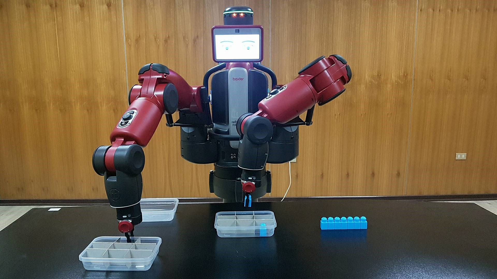

# Simulador de Producción

Baxter va tomando piezas una a una a través de un alimentador y las va ingresando en una caja subdividida en m x n partes. Luego, cuando la caja esta llena, lleva la caja a una zona de cajas llenas. Finalmente, toma una caja de la zona de cajas vacias y la deja en posición para ser llanada otra vez.

# Instrucciones

## Instalación

Copiar la carpeta “linea_de_produccion” dentro de la carpeta de **ros_ws/src**. Luego, volver a la raíz del espacio de trabajo y ejecutar el comando catkin_make.

## Montaje

Se requiere un grupo de piezas con la misma forma puestas en fila (o siendo alimentadas a través de una cinta transportadora). Además, algunas cajas subdividas en diferentes compartimentos como se ve en la figura 2.

Figura 2: Montaje Simulador de Producción

## Ejecución

1.	Se ejecuta el archivo utilizando el siguiente comando “rosrun linea_de_produccion movimiento_linea_de_produccion”. Si no aparece, dar permisos de ejecución al archivo mediante el comando chmod +x nombre_archivo.py.

2.	El programa pide guardar posiciones inicial de la fila y posición inicial de la caja utilizando el brazo izquierdo. La posición inicial de la caja corresponde a la esquina inferior derecha visto desde la perspectiva de Baxter.

3.	Con el brazo derecho, según las instrucciones que aparecen en la pantalla de Baxter,  seleccionar un punto de agarre de la caja que se va a empezar a llenar. Seleccionar lo mismo para el sector de cajas vacías y para el sector de cajas llenas.

